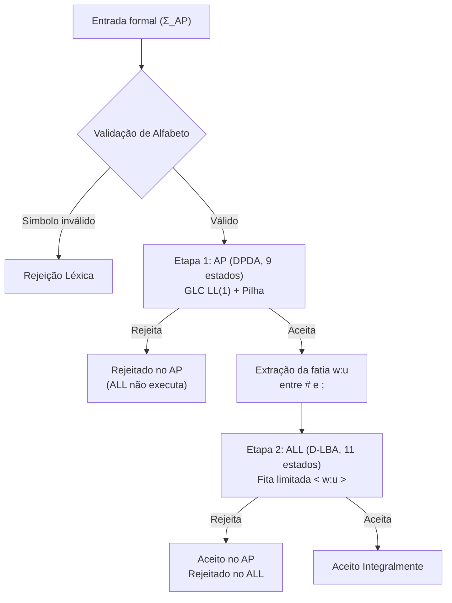

# Arquitetura do Pipeline em Duas Etapas — MiniLang-Compiler (AV2)

```mermaid
flowchart TD
    A["Entrada formal (Σ_AP)"] --> B{"Validação de Alfabeto"}
    B -- "Símbolo inválido" --> E1["Rejeição Léxica"]
    B -- "Válido" --> C["Etapa 1: AP (DPDA, 9 estados)\nGLC LL(1) + Pilha"]
    C -- "Rejeita" --> E2["Rejeitado no AP\n(ALL não executa)"]
    C -- "Aceita" --> D["Extração da fatia w:u\nentre # e ;"]
    D --> F["Etapa 2: ALL (D-LBA, 11 estados)\nFita limitada < w:u >"]
    F -- "Rejeita" --> E3["Aceito no AP\nRejeitado no ALL"]
    F -- "Aceita" --> OK["Aceito Integralmente"]
```
